# Declarative Scroll Architecture

Claude generated this doc as I was thinking through ideas for a rewrite.

## Problem

The current `use-keyboard-aware-message-list.ts` and
`use-initial-scroll-to-end.ts` hooks are highly imperative and difficult to
reason about.

### Current Issues

1. **Multiple imperative triggers for the same action**: `scrollToEnd` is called
   from:

   - `onMoveWhileClosed()`
   - The `doScrollToEnd` reaction
   - The `isMessageSendAnimating` reaction
   - Via `runOnJS(scrollToEnd)()` in `onMove`

2. **Scattered state mutations**: `doScrollToEnd`, `isMessageSendAnimating`,
   `scrollAtStart`, `amtToOffset`, etc. are mutated in many places, making it
   hard to trace causality.

3. **Implicit dependencies**: The reactions depend on multiple shared values,
   and it's not obvious which combination of states leads to which behavior.

4. **Mixed concerns**: Keyboard handling, scroll positioning, and message-send
   animations are all intertwined.

5. **Hacky timing in initial scroll**: Multiple `requestAnimationFrame` and
   `setTimeout` calls to "hope" the layout is ready.

6. **Disconnected scroll logic**: Initial scroll lives in a separate hook,
   disconnected from the keyboard-aware hook.

---

## Proposed Solution

**Core insight**: Instead of imperatively calling `scrollToEnd` from many
places, derive a "scroll intent" and let `onContentSizeChange` be the single
executor.

### 1. Separate Intent from Environmental State

**Key insight**: Scroll intent (user-driven actions) and keyboard state
(environmental context) are orthogonal concerns. Don't conflate them.

#### Scroll Intent — "Why do we want to scroll?"

```typescript
type ScrollIntent =
  | { type: 'none' }
  | { type: 'initial-scroll-to-end' } // First load, scroll to bottom
  | { type: 'message-sent'; messageIndex: number } // User sent a message, follow it

const scrollIntent = useSharedValue<ScrollIntent>({ type: 'none' })
```

#### Keyboard State — "What is the keyboard doing?"

This is separate environmental state that affects _how_ we execute the intent:

```typescript
type KeyboardState = 'hidden' | 'opening' | 'open' | 'closing'

const keyboardState = useSharedValue<KeyboardState>('hidden')
```

You can have any intent while the keyboard is in any state. They're independent
inputs to the scroll decision.

### 2. Setters Become Declarative Intent Setters

Instead of:

```typescript
// Current: imperative, scattered
runOnJS(scrollToEnd)()
doScrollToEnd.set(true)
listRef.current?.scrollToEnd({ animated: true })
```

You do:

```typescript
// Proposed: declarative intent
scrollIntent.set({ type: 'message-sent', messageIndex: 5 })
```

### 3. Single `onContentSizeChange` Executor

The `onContentSizeChange` callback becomes the **only place** that executes
scroll actions:

```typescript
const onContentSizeChange = useCallback((width: number, height: number) => {
  const intent = scrollIntent.get()

  if (intent.type === 'none') return

  // Derive whether we should scroll based on intent + current state
  const shouldScroll = deriveScrollDecision({
    intent,
    contentHeight: height,
    scrollViewHeight: scrollViewHeight.get(),
    currentScrollY: scrollY.get(),
    keyboardHeight: keyboardHeight.get(),
    blankSize: blankSize.get(),
  })

  if (shouldScroll.action === 'scroll-to-end') {
    listRef.current?.scrollToEnd({ animated: shouldScroll.animated })
  } else if (shouldScroll.action === 'scroll-to-offset') {
    listRef.current?.scrollToOffset({
      offset: shouldScroll.offset,
      animated: true,
    })
  }

  // Clear intent after handling
  if (shouldScroll.clearIntent) {
    scrollIntent.set({ type: 'none' })
  }
}, [])
```

### 4. Pure Derivation Function

The `deriveScrollDecision` is a **pure function** that takes both intent AND
keyboard state as inputs, then returns an action:

```typescript
type ScrollDecision =
  | { action: 'none'; clearIntent: boolean }
  | { action: 'scroll-to-end'; animated: boolean; clearIntent: boolean }

function deriveScrollDecision(params: {
  intent: ScrollIntent
  keyboardState: KeyboardState // Environmental context
  contentHeight: number
  scrollViewHeight: number
  currentScrollY: number
  keyboardHeight: number
  blankSize: number
}): ScrollDecision {
  const {
    intent,
    keyboardState,
    contentHeight,
    scrollViewHeight,
    currentScrollY,
    blankSize,
  } = params

  switch (intent.type) {
    case 'initial-scroll-to-end':
      // Only scroll if content exceeds viewport
      if (contentHeight > scrollViewHeight) {
        return { action: 'scroll-to-end', animated: false, clearIntent: true }
      }
      return { action: 'none', clearIntent: true }

    case 'message-sent': {
      const distFromEnd =
        contentHeight - currentScrollY - scrollViewHeight + blankSize
      const isFarAway = distFromEnd > 1000 // or whatever threshold

      // Keyboard state can affect HOW we scroll, not WHETHER we scroll
      const shouldAnimate = !isFarAway && keyboardState !== 'opening'

      return {
        action: 'scroll-to-end',
        animated: shouldAnimate,
        clearIntent: true,
      }
    }

    default:
      return { action: 'none', clearIntent: false }
  }
}
```

The intent says **WHAT** we want to do. The keyboard state affects **HOW** we do
it.

### 5. Simplified Keyboard Handler

The keyboard handler only updates keyboard state and transforms—no scroll
execution, no setting scroll intents:

```typescript
useKeyboardHandler({
  onStart(e) {
    'worklet'
    if (e.progress === 1) {
      keyboardState.set('closing')
    } else {
      keyboardState.set('opening')
    }
  },
  onMove(e) {
    'worklet'
    // Only handle translateY transform, no scroll logic
    translateY.set(computeTranslateY(e, keyboardHeight.get(), bottomInset))
  },
  onEnd(e) {
    'worklet'
    keyboardState.set(e.height > 0 ? 'open' : 'hidden')
    translateY.set(0)
  },
})
```

Keyboard state changes don't trigger scrolls directly—they just update the
environmental context that the scroll decision function uses.

---

## Benefits

| Aspect              | Current                              | Proposed                                              |
| ------------------- | ------------------------------------ | ----------------------------------------------------- |
| **Scroll triggers** | 5+ places                            | 1 place (`onContentSizeChange`)                       |
| **Testability**     | Hard (side effects everywhere)       | Easy (pure `deriveScrollDecision`)                    |
| **Debuggability**   | "Why did it scroll?" → trace 5 hooks | Check `scrollIntent` value                            |
| **Race conditions** | Possible (multiple async triggers)   | Eliminated (single executor)                          |
| **Initial scroll**  | Separate hook with hacks             | Same system, just `{ type: 'initial-scroll-to-end' }` |

---

## Migration Path

1. **Add the intent system alongside existing code** — don't remove anything yet
2. **Move `use-initial-scroll-to-end` to use intent** — simplest case
3. **Move message-send scroll to use intent**
4. **Move keyboard-aware scroll to use intent**
5. **Remove old imperative calls**

---

## Open Questions

1. **Should transform/offset logic remain in the worklet?** The keyboard
   animation needs to be smooth (60fps), so some worklet logic may need to stay.

2. **Should `onContentSizeChange` run on the UI thread?** If worklet-level
   performance is needed, the executor might need to be an `AnimatedReaction`
   instead.

3. **How to handle "in-flight" intents?** E.g., user sends a message, then
   immediately opens keyboard before content size updates.

---

## Current Architecture Flow Diagram

This diagram shows every path through the current system. The complexity is
intentional—it illustrates why a refactor is needed.


### Flow Summary by Use Case

#### 1. Initial Load (App opens with existing messages)


#### 2. Send Message (Keyboard Open → Closes)


#### 3. Send Message (Keyboard Already Closed)


#### 4. Keyboard Opens (Tap input)

```mermaid
sequenceDiagram
    participant User
    participant Native as Native Keyboard
    participant KbProvider as KeyboardStateProvider
    participant KbAware as useKeyboardAwareMessageList
    participant List as LegendList

    User->>Native: Tap input field
    Native->>KbProvider: keyboardWillShow
    KbProvider->>KbProvider: keyboardState = 'willShow'
    KbProvider->>KbProvider: keyboardHeight.set(height)

    KbProvider->>KbAware: onStart(e) [progress=0, opening]
    KbAware->>KbAware: isOpening = true
    KbAware->>KbAware: shouldOffsetCloseKeyboard = true
    KbAware->>KbAware: Calculate distFromEnd
    KbAware->>KbAware: getOffsetWhenOpening()
    KbAware->>KbAware: amtToOffset.set(calculated)
    KbAware->>KbAware: amtToTransform.set(kbHeight - bottomInset)

    loop Every frame
        KbProvider->>KbAware: onMove(e) [progress 0→1]
        KbAware->>KbAware: getValuesOnMove()
        KbAware->>KbAware: offsetY.set(interpolated)
        KbAware->>KbAware: translateY.set(progress * transform)
    end

    Native->>KbProvider: keyboardDidShow
    KbProvider->>KbAware: onEnd(e)
    KbAware->>KbAware: Re-enable scroll processing
```



#### 5. Interactive Keyboard Dismissal (Swipe down)


#### 6. Content Changes While Keyboard Open


#### 7. Composer Height Changes


### All `scrollToEnd` Call Sites

| Location                          | Trigger                             | Animated |
| --------------------------------- | ----------------------------------- | -------- |
| `useInitialScrollToEnd`           | blankSize >= 0 (first time)         | false    |
| `useKeyboardAwareMessageList`     | `scrollToEnd()` helper              | true     |
| `useKeyboardAwareMessageList`     | Reaction 3 (far away, kb closed)    | true     |
| `useAutoscrollFromComposerHeight` | composerHeight changes, near bottom | false    |

### All `offsetY.set()` Call Sites

| Location                      | Trigger                              | Animation  |
| ----------------------------- | ------------------------------------ | ---------- |
| `useKeyboardAwareMessageList` | `onMove()` during keyboard animation | immediate  |
| `useKeyboardAwareMessageList` | `onMoveWhileClosed()`                | withTiming |

### All `translateY.set()` Call Sites

| Location                      | Trigger                              |
| ----------------------------- | ------------------------------------ |
| `useKeyboardAwareMessageList` | `onMove()` during keyboard animation |
| `useKeyboardAwareMessageList` | `onStart()` reset after interactive  |
